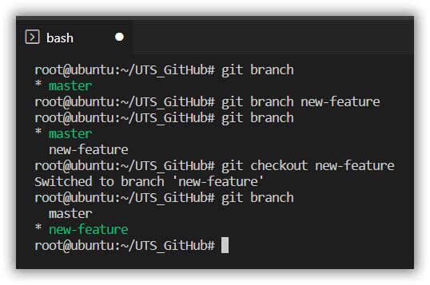
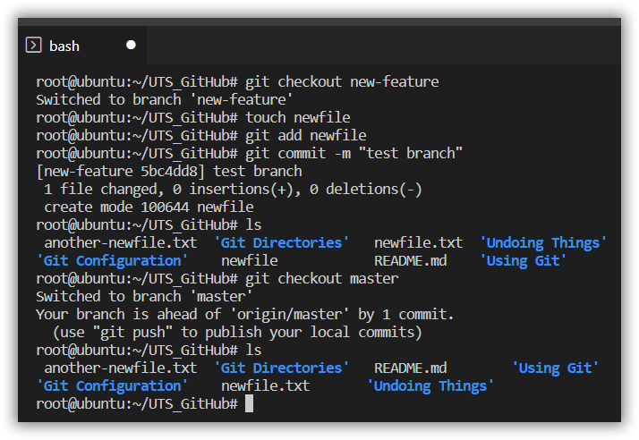
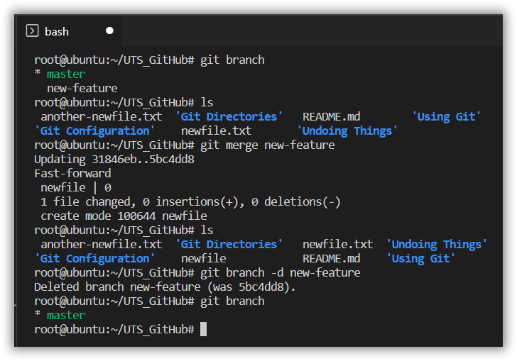

# Branch :
```
You can create a Branch using :
```
```
$ git branch
$ git branch new-feature
$ git branch
$ git checkout new-feature
$ git branch
```



# Merge
```
You can merge your source code on another branch with :
```
```
Merge Branch :
$ git merge new-feature

Delete Branch :
$ git branch -d new-feature
```

