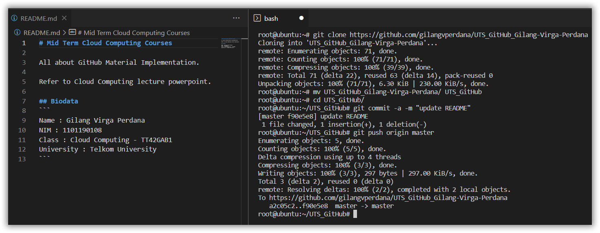

# Remote Repository
```
Basic Commands of GitHub
```

## Clone 
```
$ git clone https://github.com/gilangvperdana/UTS_GitHub_Gilang-Virga-Perdana
$ cd UTS_GitHub_Gilang-Virga-Perdana/
Edit README.md
```

## Push
```
$ git commit -a -m "update README"
$ git push origin master
```


## Remotes General :
```
$ cd UTS_GitHub_Gilang-Virga-Perdana/
$ git remote -v
$ git status
```


## Fetch New Update :
```
$ git fetch
$ git status
$ git merge origin/master
```


## Update Local Repository :
```
$ git pull
```
