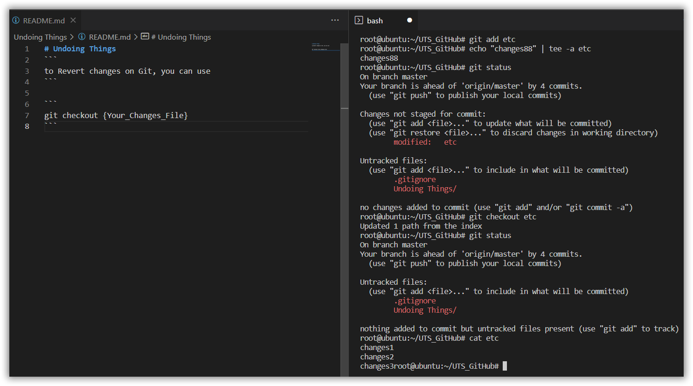
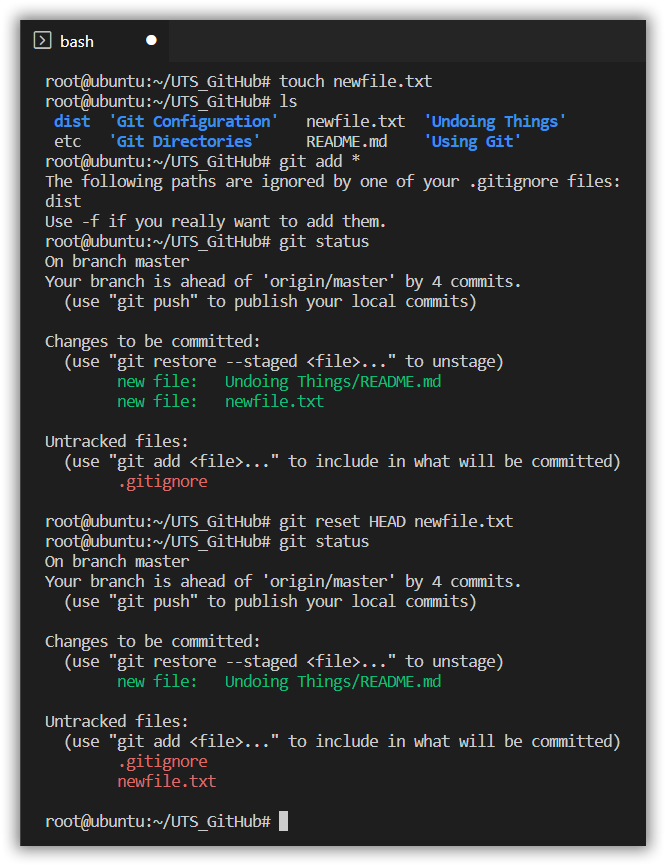
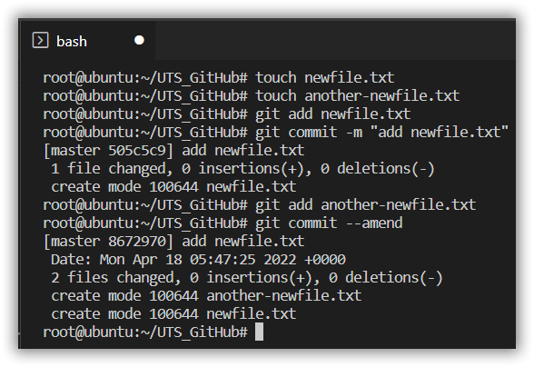
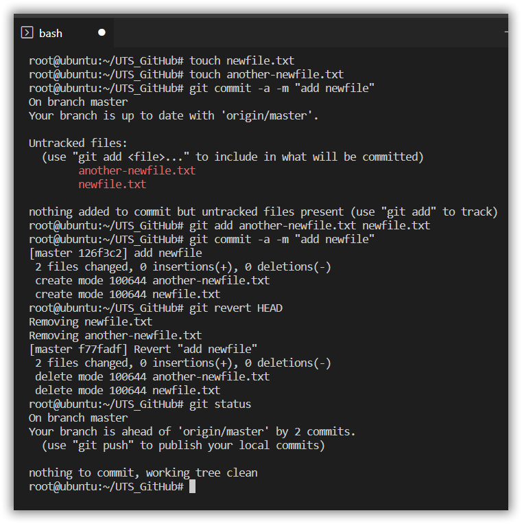
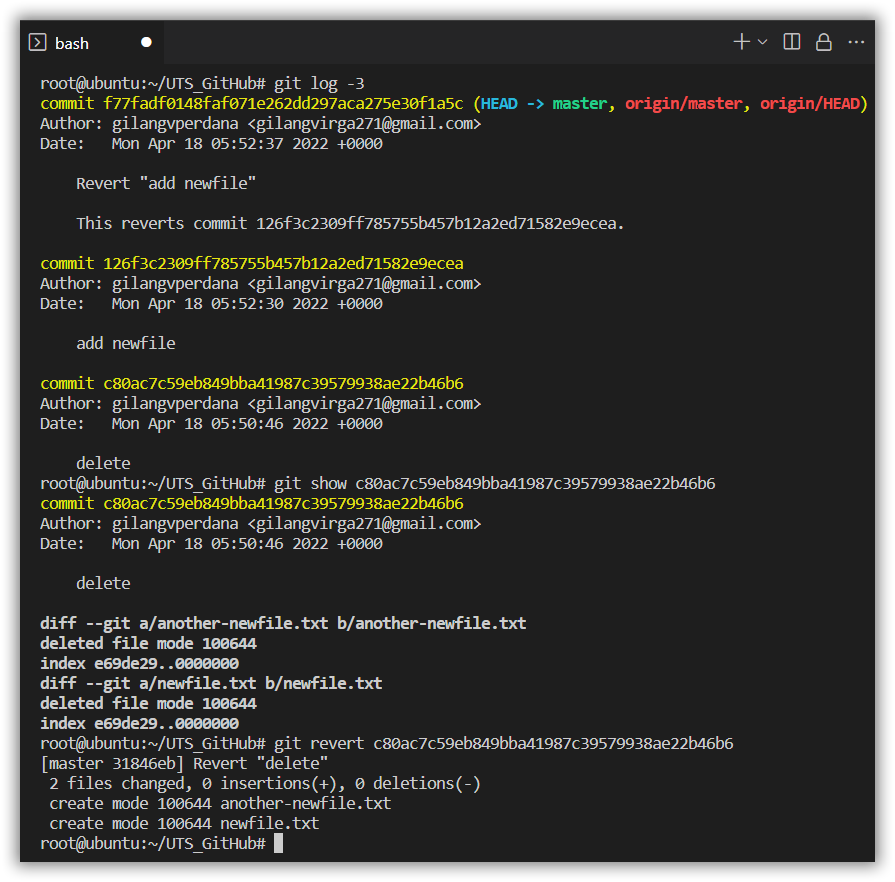

# Undoing Things
```
to Revert changes on Git, you can use
```
## 1
```
git checkout {Your_Changes_File}
```



## 2
```
touch newfile.txt
git add *
git status
git reset HEAD newfile.txt
git status
```


## 3
```
git add newfile.txt
git commit -m "add new script"
git add another-newfile.txt
git commit --amend
```


## 4
```
git commit -a -m "new"
git revert HEAD
```


## 5
```
git log -2
git show {commit_id}
git revert {commit_id}
```
