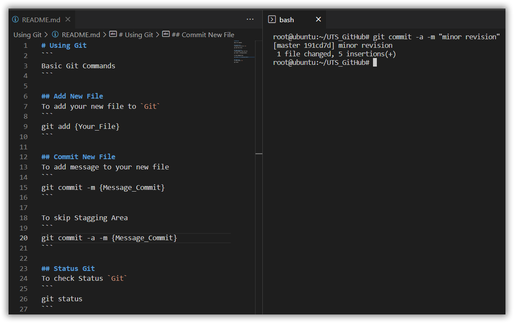
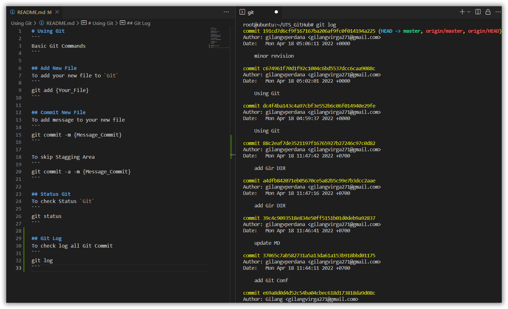

# Using Git
```
Basic Git Commands
```

## Add New File
To add your new file to `Git`
```
git add {Your_File}
```

## Status Git
To check Status `Git`
```
git status
```

## Commit New File
To add message to your new file
```
git commit -m {Message_Commit}
```


To skip Stagging Area
```
git commit -a -m {Message_Commit}
```


## Git Log
To check log all Git Commit
```
git log
```

